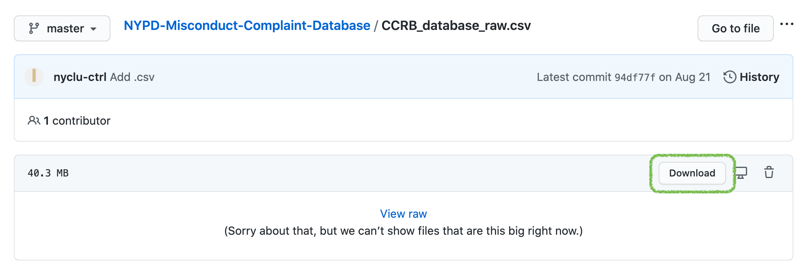
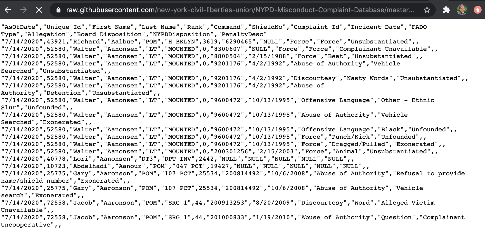

background-image: url(https://upload.wikimedia.org/wikipedia/commons/b/be/Sharingan_triple.svg)

```{r setup, include=FALSE}
options(htmltools.dir.version = FALSE)
require(tidyverse)
require(magrittr)
require(english)
```

???

Image credit: [Wikimedia Commons](https://commons.wikimedia.org/wiki/File:Sharingan_triple.svg)

---
class: inverse, middle

# Reading the data

---

The data are uploaded on the [New York Civil Liberties Union's GitHub account](https://github.com/new-york-civil-liberties-union/NYPD-Misconduct-Complaint-Database).



---

Clicking the "Download" button takes us to the link for the raw CSV hosted on GitHub. We can see in the browser that this is indeed straight up comma-separated values, so reading data from this link directly into an R dataframe should work smoothly.



---

`read_csv` from the tidyverse's `readr` package allows us to read data directly from the URL of a web-hosted CSV file. Other CSV reading functions would require us to use another function to download the data from the web to our machine first, and then read the CSV into R.

--

We can copy the https link from the GitHub URL of the raw file and feed it in as the `file` argument of `read_csv()`.

---

```{r}
tryCatch({complaints <- read_csv("https://raw.githubusercontent.com/new-york-civil-liberties-union/NYPD-Misconduct-Complaint-Database/master/CCRB_database_raw.csv",
                       na = c("", "NA", "NULL"))},
         finally = {complaints <- read_csv("CCRB_database_raw.csv",
                       na = c("", "NA", "NULL"))}
         )

```

(Note that we need to add `"NULL"` as one of the values to be rendered as `NA`.)

---

Next, the NYCLU warns that some of the rows in the data may be duplicated. As a quick pass, we can keep only unique rows.

To see if we are indeed discarding rows, let's check how many rows are in the data right now:

```{r}
nrow(complaints)
```

--

Now, we will de-duplicate the data:

```{r}
complaints %<>%
  distinct()
```

How many rows did we drop?

--

```{r}
nrow(complaints)
```

Oh gosh!

---

Note the double-sided pipe `%<>%` from `magrittr`, which overwrites the input of the pipe with the output of the pipe after computation is completed.

--

Thus, this bit of code

```{r, eval = FALSE}
complaints %<>%
  distinct()
```

--
is equivalent to, and less verbose than, the following:

```{r, eval = FALSE}
complaints <- complaints %>%
  distinct()
```

---

Next, we can drop a couple redundant columns to reduce data size.

--

`AsOfDate` marks the preparation date of the data, so it will be the same for every row (and thus doesn't need to be repeated over 300,000 times).

--

In addition, `Unique Id`, combined `First Name` & `Last Name`, and `ShieldNo` all uniquely identify officers. Since we have no other data linking shield number to anything else, we may as well drop that column because it's meaningless to us.

--
```{r}
complaints %<>%
  select(-AsOfDate, -ShieldNo)
```

---

Next, let's re-spell some column names for ease of later processing.

Several of the column names have spaces in them, making them illegal variable names that we would need to quote using backticks in our code, which gets pretty annoying.

```{r}
names(complaints)
```

We can use the new `dplyr`'s `rename_with()` to run `str_remove_all()` across every column in the data, removing spaces if they are present in the column name.

```{r}
complaints %<>%
  rename_with(~str_remove_all(., " "), .cols = everything())
```

```{r}
names(complaints)
```


---

Finally, for pre-cleaning, we can change the data type and formatting of some columns to save space and facilitate processing.

- change all numeric columns to integer to reduce data size
- render any date columns as date-time type

We will use `dplyr`'s new `across()` helper function inside of `mutate()` to use logical functions (for coercing numeric columns to integer) and name-based functions (for catching date columns) to choose columns to mutate.

```{r}
complaints %<>%
  mutate(across(where(is.numeric), as.integer),
         across(ends_with("Date"), lubridate::mdy))

complaints
```

---

class: inverse, middle

# What do the columns mean?

---

Most of this info comes from the NYCLU's informal data dictionary on [their website](https://www.nyclu.org/en/campaigns/nypd-misconduct-database).

`UniqueId`, `FirstName`, `LastName`, `Rank`, and `Command` all identify officers. (These entries may be repeated for officers with multiple complaints against them, or for a single complaint with multiple misconduct allegations.)

```{r}
complaints %>% 
  select(UniqueId:Command) %>% 
  distinct() %>% 
  sample_n(5)
```

Note that `Rank` and `Command` appear to index officers' most recent rank at time of database pull, not their rank at time of incident. For example, officers with multiple complaints lodged against them over the years have only one rank listed for all those complaints.

---

The rest of the columns are specific to each complaint.

`ComplaintId` and `IncidentDate` identify whole incidents. Values may be repeated for incidents with multiple misconduct allegations occurring within a single police encounter.

The rest of the columns are complaint-specific. Note that dispositions (rulings) from the CCRB and NYPD are made separately for each complaint. Thus, a single incident may involve multiple misconduct complaints, and those may have distinct rulings for them (say, one may be substantiated while another may be exonerated).

```{r}
complaints %>%
  select(ComplaintId:PenaltyDesc) %>% 
  sample_n(5)
```

---

`FADOType` is an unordered categorical column sorting each complaint into one of four categories of misconduct type.

--

```{r}
complaints %>% 
  count(FADOType)
```

--
As you can see, the column's eponymous levels are:

--

- Force
  
--

- Abuse of authority (includes many things: sexual harassment, threats, refusal to show officer docs, search of body or property without warrant, etc)
  
--

- Discourtesy (general rudeness?)
  
--

- Offensive language (specifically demographic slurs)

---

The `Allegation` column gives a (very slightly, in some cases) more detailed description of each misconduct complaint over and above the four-level categorical coding in `FADOType`.

--

```{r}
complaints %>% 
  distinct(FADOType, Allegation) %>% 
  sample_n(5)
```

--

The `Allegation` column has `r length(unique(complaints$Allegation))` unique values. Our guess is that a categorical data entry system was indeed used to log allegation information, but there are too many unique values to analyze the allegation data without recoding it in some way to order the allegations by severity and/or bin the allegations into more columns.

---

The next column, `BoardDisposition`, logs the board's determination of the complaint. Here, we can refer to the [CCRB's Data Transparency Initiative pages](https://www1.nyc.gov/site/ccrb/policy/data-transparency-initiative-allegations.page) to parse the CCRB rulings, and possibly order them.

--

> ### Dispositions of Fully Investigated Allegations
>

--

> An allegation is **substantiated** if misconduct is found to be improper based on a preponderance of the evidence.

--

> An allegation is **unsubstantiated** if there is not enough evidence to determine whether or not misconduct occurred.

--

> An allegation is **unfounded** if a preponderance of the evidence suggests that the event or alleged act did not occur.

--

> An allegation is **exonerated** if the event did occur but was not improper by a preponderance of the evidence.

--

> The case is closed as **officer unidentified** if the CCRB was unable to identify any of the officers accused of misconduct.

--

> Additionally, a complaint can be **mediated** if all parties consent. The NYPD officer and complainant/victim or alleged victim discuss the incident in the presence of a neutral third-party moderator.

---

> ### Disposition of Truncated Allegations

--

> An allegation is closed as **complaint withdrawn** when the complainant voluntarily withdraws the complaint.

--

> An allegation is closed as **complainant/victim/witness unavailable** when the complainant, victim and/or witness cannot be located after multiple and varied attempts (This also includes complaints in which the complainant is incarcerated and the attorney advises no contact).

--

> An allegation is closed as **complainant/victim/witness uncooperative** when the participation of the complainant, victim and/or witness is insufficient to enable the board to conduct a full investigation.

--

> An allegation is closed as **victim unidentified** when the board is unable to identify the victim.

---

```{r}
unique(complaints$BoardDisposition)
```

--

There are definitely more than nine levels here, but it looks like several of them collapse neatly into one of the nine levels listed by the CCRB.

---

The next column, `NYPDDisposition`, describes the NYPD's determination of any substantiated complaint. (NYPD rulings appear to be made _after_ CCRB rulings, such that complaints are only elevated to the NYPD to determine penalty and/or further investigation if the CCRB rules the complaint substantiated.)

```{r}
complaints %>%
  filter(!is.na(NYPDDisposition)) %>%
  count(BoardDisposition)
```

---

Like `Allegation`, `NYPDDisposition` looks to have been entered with a categorical coding system, but there are `r complaints %>% filter(!is.na(NYPDDisposition)) %>% distinct(NYPDDisposition) %>% nrow()` unique values that could be standardized and/or ordered further.

```{r}
complaints %>% 
  filter(!is.na(NYPDDisposition)) %>% 
  pull(NYPDDisposition) %>% 
  unique()
```

---

Finally, `PenaltyDesc` describes penalties, if any, that were levied by the NYPD against the officer in question for each complaint.

```{r}
complaints %>% 
  filter(!is.na(PenaltyDesc)) %>% 
  pull(PenaltyDesc) %>% 
  unique()
```

---

class: inverse, middle

# Clean the data

---

The columns that look the most likely to need cleaning are `Allegation`, `BoardDisposition`, `NYPDDisposition`, and `PenaltyDesc`. While they all appear to have been entered using a categorical entry system (so hopefully no free-response), there are a whole lot of levels that can be condensed for easier visualization.

--

Re: recoding `Allegation`, for our purposes,  we suspect "F-A-D-O" categorical coding will be sufficient for preliminary exploration of complaints by misconduct type. We won't work on recoding `Allegation` for now.

---

### Separating recommended penalties out of `BoardDisposition`

The next column, `BoardDisposition`, looks to be more tractable to recode. Based on CCRB data descriptions, there should be at maximum nine meaningful levels in the data. We can probably do a bit of work to condense some category levels together to get down from `r english(length(unique(complaints$BoardDisposition[!is.na(complaints$BoardDisposition)])))` to nine.

If we look more closely, we see that the biggest offender of messy levels is "Substantiated". All "Substantiated" values have a parenthetical statement appended to them.

```{r}
complaints %>% 
  filter(grepl("\\(", BoardDisposition)) %>% 
  distinct(BoardDisposition)
```

--

It looks like these parentheticals correspond to the CCRB's recommended penalty for these complaints.

The CCRB describes the [three main families of penalty](https://www1.nyc.gov/site/ccrb/prosecution/police-discipline.page) that may be recommended for substantiated cases from least to most severe:

1. Attending additional training (`"Command Lvl Instructions"`, `"Formalized Training"`)
  1. Note that Command-Level Instructions, which are administered by an officer's direct superior, appear to be equally severe as Formalized Training, which are administered by the Police Academy or NYPD Legal Bureau
1. `Command Discipline` (which appear to primarily involve docking vacation days)
1. `Charges` that are prosecuted administratively in the [NYPD Trial Room](https://www1.nyc.gov/site/nypd/bureaus/administrative/trials.page). Note that these are _internal_ trials with the NYPD Administrative Prosecution Unit, _not_ proper criminal cases.

---

First, we can break the `BoardDisposition` column into two. For any substantiated claims, the second column will contain the recommended penalty, with `NA` for claims not labeled as substantiated.

Here, we're relying on the fact that only the "Substantiated" claims have a parenthetical statement after them. Telling `separate()` to split the `BoardDisposition` column at a space followed by an open parenthesis should fill the new column, `PenaltyRec`, with whatever was in the parentheses if applicable, while filling it with `NA` for rows that don't have parentheses.

```{r}
complaints %<>%
  separate(BoardDisposition,
           into = c("BoardDisposition", "PenaltyRec"),
           sep = " \\(",
           fill = "right")

complaints %>% 
  distinct(BoardDisposition, PenaltyRec)
```

---

After we break the column into two, we clean `PenaltyRec` by removing that pesky final close parenthesis from the end of each recommended penalty.

```{r}
complaints %<>%
  mutate(PenaltyRec = str_remove(PenaltyRec, "\\)"))

complaints %>% 
  distinct(PenaltyRec)
```


---

### Condensing levels of `BoardDisposition`

That takes care of `BoardDisposition == "Substantiated"`. (We'll worry about that new `PenaltyRec` column soon.) Next, we can bin together a few more of the remaining levels. We'll try to stick to the bins laid out on the CCRB website, so that we don't create any false equivalencies.

```{r}
complaints %<>%
  mutate(BoardDisposition = case_when(
    grepl("Unavailable", BoardDisposition) ~ "ComplainantVictimWitness Unavailable",
    grepl("Uncooperative", BoardDisposition) ~ "ComplainantVictimWitness Uncooperative",
    startsWith(BoardDisposition, "Miscellaneous - ") ~ "Officer(s) Left",
    TRUE ~ BoardDisposition
  )
  )
```

---

This should get us down to a slightly more workable number of levels.

```{r}
complaints %>% 
  count(BoardDisposition) %>% 
  arrange(desc(n))
```

---

### Condensing `BoardDisposition` to even fewer levels

As a final pass, we can make another version of `BoardDisposition` with even fewer bins, in case that makes later visualizations more straightforward.

The CCRB broke their determinations into two supercategories: **fully investigated** and **truncated** allegations. In fully investigated allegations, we can assume that if a claim was not marked as substantiated, the CCRB determined that misconduct did not occur as alleged. However, for truncated allegations, there is no final determination. Theoretically, those claims may have been substantiated if they had been able to be investigated fully.

---

First, we will create `BoardDispositionShort` by `NA`ing out all "Miscellaneous" entries (since we don't know whether they were fully investigated or closed). Then, we will use `forcats::fct_recode()` to finish recoding the new column, by collapsing the other levels into larger bins.

```{r}
complaints %<>%
  mutate(BoardDispositionShort = na_if(BoardDisposition, "Miscellaneous"),
         BoardDispositionShort = fct_recode(
           BoardDispositionShort,
           # omit Substantiated, leave that as is
           `Investigated Not Substantiated` = "Unsubstantiated",
           `Investigated Not Substantiated` = "Unfounded",
           `Investigated Not Substantiated` = "Exonerated",
           `Investigated Not Substantiated` = "Officer(s) Unidentified",
           `Truncated` = "Complaint Withdrawn",
           `Truncated` = "ComplainantVictimWitness Unavailable",
           `Truncated` = "ComplainantVictimWitness Uncooperative",
           `Truncated` = "Victim Unidentified",
           `Truncated` = "Officer(s) Left",
           `Truncated` = "Closed - Pending Litigation"
         ),
         BoardDispositionShort = fct_relevel(
           BoardDispositionShort,
           "Truncated",
           "Investigated Not Substantiated",
           "Substantiated"
         ))
```

```{r}
complaints %>% 
  count(BoardDispositionShort) %>% 
  arrange(desc(n))
```

---

### Condensing levels of `PenaltyRec`

```{r}
complaints %>% 
  count(PenaltyRec) %>% 
  arrange(desc(n))
```

---

`PenaltyRec == "MOS Unidentified"` "MOS" stands for "member of service", or another term for a uniformed NYPD officer. It's a bit unclear how a claim can be substantiated against a named officer, and then the recommended penalty is listed as "officer unidentified". There's only a few of these cases though, so `NA`ing them out may be the most straightforward.

```{r}
complaints %<>%
  mutate(PenaltyRec = na_if(PenaltyRec, "MOS Unidentified"))
```

---

### Ordering levels of `PenaltyRec`

After that, we can recode to condense the rest of the levels according to the CCRB outline. We'll bin all the Instructions level penalties together since there's nothing to indicate that one is more severe than the other, but we will keep Command Disciplines A and B separate because B is listed as more severe than A.

```{r}
complaints %<>%
  mutate(PenaltyRec = fct_recode(PenaltyRec,
                                 Instructions = "Command Lvl Instructions",
                                 Instructions = "Formalized Training",
                                 `Command Discipline` = "Command Discipline A",
                                 `Command Discipline` = "Command Discipline B"),
         PenaltyRec = fct_relevel(PenaltyRec,
                                  "No Recommendations",
                                  "Instructions",
                                  "Command Discipline",
                                  "Charges"))
```

```{r}
complaints %>% 
  ggplot(aes(x = PenaltyRec)) +
  geom_bar() +
  scale_y_log10()
```

---

### Condensing values in `NYPDDisposition`

"Negttn" may be short for Negotiation

```{r}
complaints %<>%
  mutate(NYPDDisposition = if_else(startsWith(NYPDDisposition, "APU Closed") | NYPDDisposition == "No Finding" | grepl("No Disciplinary Action", NYPDDisposition),
                                   "Closed",
                                   NYPDDisposition),
         NYPDDisposition = if_else(grepl("not guilty", NYPDDisposition, ignore.case = TRUE),
                                   "Not Guilty",
                                   NYPDDisposition),
         NYPDDisposition = if_else(grepl("Guilty", NYPDDisposition) & !grepl("Not", NYPDDisposition),
                                   "Guilty",
                                   NYPDDisposition),
         NYPDDisposition = if_else(grepl("Nolo contend", NYPDDisposition),
                                   "No Contest",
                                   NYPDDisposition),
         NYPDDisposition = if_else(grepl("Dismissed", NYPDDisposition),
                                   "Charge Dismissed",
                                   NYPDDisposition),
         NYPDDisposition = if_else(grepl("Decision Pending", NYPDDisposition) | grepl("Filed", NYPDDisposition),
                                   "Decision Pending",
                                   NYPDDisposition),
         NYPDDisposition = if_else(grepl("Instructions", NYPDDisposition) | grepl("Training", NYPDDisposition),
                                   "Instructions",
                                   NYPDDisposition),
         NYPDDisposition = if_else(grepl("with discipline", NYPDDisposition),
                                   "Command Discipline",
                                   NYPDDisposition),
         NYPDDisposition = if_else(grepl("Command Discipline", NYPDDisposition),
                                   "Command Discipline",
                                   NYPDDisposition),
         NYPDDisposition = str_replace(NYPDDisposition, " - ", " "),
         NYPDDisposition = str_replace(NYPDDisposition, "APU Command Discipline", "Command Discipline")
         )
```

---

```{r}
complaints %<>%
  mutate(NYPDDisposition = fct_relevel(NYPDDisposition,
                                       "Instructions",
                                       "Command Discipline",
                                       "Closed",
                                       "Charge Dismissed",
                                       "Decision Pending",
                                       "Not Guilty",
                                       "No Contest",
                                       "Guilty"))
```


---

```{r}
complaints %>% 
  distinct(NYPDDisposition) %>% 
  pull(NYPDDisposition)
```

---

### Condensing values in `PenaltyDesc`

Now that we have cleaned up `PenaltyRec`, we can try to clean `PenaltyDesc` analogously. Ideally, we'll get it to a point where we can compare CCRB-recommended penalties and NYPD-levied penalties for cases that make it to the "Substantiated" level. This may take some more work.

---

One thing we can see off the top is that several officers appear to have received double-barreled penalties. For example, officers might have to take additional training (less severe) forfeit paid vacation days (more severe).

Whatever data entry system that was used to log these does not seem to be using a consistent prefix for when forfeited vacation days are listed in the penalty.

```{r}
complaints %>% 
  distinct(PenaltyDesc) %>% 
  filter(grepl("\\+", PenaltyDesc))
```

---

For a rough recoding, we can try to condense all double-barreled penalties down to a single penalty per complaint. Then, we can keep only the more severe penalty for each complaint, thus rounding up to the nearest penalty.

--

Blessedly, one thing that _does_ appear consistent is that whenever distinct penalties are levied, they look to be separated with a `+` in that record. We can use this as the separator pattern in `str_split()` to turn `PenaltyDesc` into a list-column of character vectors. For most cases, the vector will be `NA` or length 1 for a single penalty. 

First, we use `stringr::str_split()` to turn `PenaltyDesc` into a list-column of character vectors. If a row _doesn't_ have a ` + ` (we include the surrounding spaces in the split delimiter so we don't have to trim them later), then it is unmodified, turning into a character vector of length 1. If a row _does_ have a ` + `, it is split into a character vector of length 2.

```{r}
complaints %<>%
  mutate(PenaltyDesc = str_split(PenaltyDesc, " \\+ "))
```


After this, we use `tidyr::unchop()` to pull `PenaltyDesc` back out into an atomic character column, repeating rows where appropriate for complaints with multiple penalties applied. `unchop()` is like `unnest()`, but instead of unnesting nested dataframes, we unchop a listed column into an atomic column.

```{r}
complaints %<>%
  unchop(PenaltyDesc)
```

---

Now that we have one penalty per row, we can clean up all entries in `PenaltyDesc`. This will take a little bit more hand-recoding. We did much of this by visually inspecting the levels of `PenaltyDesc` to match up different spellings of equivalent categories.

--

First, binning "Instructions"-level penalties:

```{r}
complaints %<>%
  mutate(PenaltyDesc = if_else(grepl("Instruction", PenaltyDesc) | grepl("Training", PenaltyDesc),
                               "Instructions",
                               PenaltyDesc))
```

--

Next, binning different spellings of docked vacation days:

```{r}
complaints %<>%
  mutate(PenaltyDesc = if_else(startsWith(PenaltyDesc, "Forfeit vacation"),
                               str_replace(str_remove(PenaltyDesc, "days"),
                                           "Forfeit vacation",
                                           "Vacation days:"),
                               PenaltyDesc))
```

---

Similarly, binning different spellings of unpaid suspension days:

```{r}
complaints %<>%
  mutate(PenaltyDesc = if_else(PenaltyDesc == "Suspension",
                               "Suspen. days",
                               PenaltyDesc))
```

--

Next, binning apparent "no penalty" determinations:

```{r}
complaints %<>% 
  # Dismissed here seems to refer to charges, not the officer's job
    mutate(PenaltyDesc = if_else(grepl("no penalty", PenaltyDesc, ignore.case = TRUE) | PenaltyDesc %in% c("Not Guilty - DCT", "Charges Dismissed - DCT", "Dismissed"),
                                 "No Penalty",
                                 PenaltyDesc))
```

---

Standardizing spellings of "Command Discipline" penalties:

```{r}
complaints %<>% 
  mutate(PenaltyDesc = if_else(startsWith(PenaltyDesc, "Command Discipline"),
                               "Command Discipline",
                               PenaltyDesc))
```

--

And of "Terminated" penalties (rare as they may be):

```{r}
complaints %<>%
  mutate(PenaltyDesc = if_else(PenaltyDesc %in% c("Termination", "Terminated", "Resigned", "Retire"),
                               "Employment Ended",
                               PenaltyDesc))
```

---

Standardizing spellings of "Warned and admonished":

```{r}
complaints %<>%
  mutate(PenaltyDesc = if_else(startsWith(PenaltyDesc, "W&A") | PenaltyDesc == "Reprimand",
                               "Warned and admonished",
                               PenaltyDesc))
```

--

On [Page 6 of the 2018 NYPD Discipline Guide](https://www1.nyc.gov/assets/nypd/downloads/pdf/analysis_and_planning/discipline/discipline-in-the-nypd-2018.pdf), Dismissal Probation is described as a 12-month probationary period where the officer must report extra. They may be reinstated or dismissed at the end of the probation period depending on their performance.

There doesn't appear to be any additional hard documentation as to whether any officers who were put on probation _actually_ ended up getting terminated. From eyeballing it, every time "Probation months:" is listed with a number, it's listed at 12, so it may be reasonable for us to assume that "Probation months:" is equivalent to Dismissal Probation, and the varying penalty amount doesn't need to apply here.

```{r}
# Note that we are discarding the 12 months count for any that were listed as "Probation months:"
complaints %<>%
  mutate(PenaltyDesc = if_else(grepl("Probation", PenaltyDesc),
                               "Dismissal Probation",
                               PenaltyDesc))
```

--

Finally, `NA`ing out "Decision Pending" cases with the NYPD APU, since we don't know what the penalty is.

```{r}
complaints %<>%
  mutate(PenaltyDesc = na_if(PenaltyDesc, "APU - Decision Pending"))
```

---

### Separating variable numbers of docked vacation days and suspension days

```{r}
complaints %>% 
  filter(grepl("\\:", PenaltyDesc)) %>% 
  distinct()
```


```{r}
complaints %<>%
  separate(PenaltyDesc, into = c("PenaltyDesc", "PenaltyDescAmt"), sep = "\\:", fill = "right") %>% 
  mutate(PenaltyDescAmt = as.integer(PenaltyDescAmt))
```

---

### Ordering levels of PenaltyDesc

```{r}
complaints %<>%
  mutate(PenaltyDesc = fct_relevel(PenaltyDesc,
                                  "No Penalty",
                                  "Warned and admonished",
                                  "Instructions",
                                  "Command Discipline",
                                  "Vacation days",
                                  "Suspen. days",
                                  "Dismissal Probation",
                                  "Employment Ended"))
```

---

### Filtering down to one penalty per substantiated complaint

```{r}
complaints %<>%
  group_by(UniqueId, ComplaintId, FADOType, Allegation) %>% 
  filter(as.integer(PenaltyDesc) == max(as.integer(PenaltyDesc)) | is.na(PenaltyDesc)) %>% 
  ungroup()
```

---

class: inverse, middle

# Finishing up

---

We now write out the intermediate data so that the data cleaning code doesn't need to be re-run every time we want to graph--only when we want to change the data cleaning processes.

Because subsequent analyses will also be done in R, we `save()` the data out to .rda so the resultant files take up less space (binary encoding is much smaller than equivalent human-readable CSV encoding).

```{r}
save(complaints, file = "nypd_ccrb_data_clean.rda")
```

